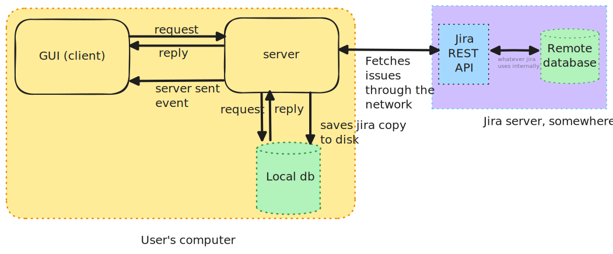

# Design

## Cache everything

The main goal of the project is to provide a great user experience. Consequently, user
interactions need to be fast. There shouldn't be any perceivable delays when a user
clicks on a button.

To achieve that goal, no network request to a jira server shall appear on the critical
path between the user click and the screen update. This is because any request to a jira
server returning interesting data has been measured to take at least 700ms, which is way
more than the maximum delay that can be reasonably considered acceptable for user interaction.

Fortunately, there is a simple trick that can be used here. Jira tickets are not modified
often, consequently it is possible to download them and save them to disk. When a user wants
to view a ticket, the software will simply retrieve the data locally. Nowadays, disk access
are fast enough that using an SQL database for storage without further optimisation is good
enough for user interactions.

## Client / Server model

The application is divided in two components which communicates through a (admittedly poor)
bespoke communication protocol following a client/server model.

One part is the GUI (or client) which is responsible for showing the jira issues to the user.
It is stateless and registers user requests (such as "view issue PROJ-124"), then forwards the
request to the second component, waits for the reply and then puts the data related to PROJ-124
on the screen. This is the client.

The other component is the server. It holds the "business" logic of the application, it is
responsible for managing the local database and keep it in sync as much as possible with the
jira server in a background thread. It is also responsible for listening to incoming
requests and answer them.

The usage and data flow is as follow:

Strictly speaking, there is no need to separate the two functions in different components and
incur a bit of latency and complexity due to the need of a communication protocol between them.
However, forcing this schema has the nice property that writing tests for one part or the
other can be made significantly easier since mocking one part becomes trivial.

Another benefit, and the real reason behind this choice, is that by completely decoupling
the two, it becomes easy to use different technologies for each component. The UI could
be implemented using native controls (Qt, Gtk, Win API, Cocoa ...) or a web UI in one language
(python, C, C++, ...), whereas the server could be implemented in a different language.
This allows for using the best technologies for each component's constraints. The client
could even be an IDE like emacs/vim/jetbrains and provide a context popup when the user would hover
a text that matches a jira issue key.

Note that the server can send unsolicited replies. This is akin to server-sent-events in
web development. An example here would be if after a periodic background synchronisation
with the the remote jira, the server realises there are new tickets, and notifies the
client about it. This can be useful for the gui to show a popup to the user and notify him
of new jira tickets.

## Communication between client and server

The communication medium between the client and the server is simply the standard input
and output from the server. This might seem unusual nowadays where most server/client
software use an HTTP or DBUS based interface.

Both methods have pros and cons. 

On the plus side of using an HTTP or DBUS-like based communication, the server can be used like a
unix daemon. Periodic synchronisation with the jira remote can be done without having a gui window
opened all the time, taking resources and annoying the user when he cycles through windows using
alt+tab.

On the cons side, it would mean that when the UI would start, it would have to "find" the server.
This often leads to issues where the UI doesn't show anything because the user forgot to start
the server first, or because the UI doesn't have network access permission, or the firewall rules
block binding to network ports.

On this one, I made the choice that reliability was more important than convenience. In other words
the GUI will have the responsibility of executing the server and "connecting" to it via its
stdin/out. When the GUI exits, it has the responsibility to kill the server.

From a user point of view, there shouldn't be a need to even know about this client/server split.
A user should simply have to start the GUI and everything should just work.

If some developer prefer the other way around, i.e. having a network interface, a simple way to do
so is to wrap the server in a layer binding to a socket and forwarding data from the network to
the stdin/out. Or simpy modify the server code to listen on the network.
