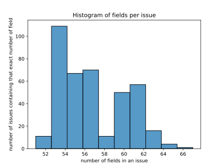
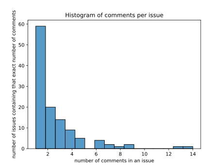

# Current issues and possible improvements.

This project, at its current state (commit badf132c0b9bc9944120df63b75ae06750f4e05b) is far
from being finished.

There are currently quite a few things I would consider issues or axis of improvements listed below.

## Code hygiene / linter rules

### Problem
Linters are useful to forbid error-prone constructs, leading to fewer bugs and maintaining
a project easier in the long run. However, so far, I didn't take the time to setup lint
rules to be respected across the project. At the very least, forbidding `unwrap` should
be part of it.

### Solution
Set up `cargo clippy` in the project

### Difficulty
Easy


## Code hygiene / warnings when compiling

### Problem
Compiling the project generates many (benign) warnings. About 200 at the moment.
Those are mostly about unused imports, functions never used, or struct fields not written in snake_case style.

### Solution
Fix those and then add a lint to forbid warnings. Careful about renaming fields though as some are used
by sqlx when extracting data from the database. For these, renaming the field requires to change the sql
requests from `SELECT field_name ...` to `SELECT field_name as NewName`.

### Difficulty
Easy


## Config file generator

### Problem
When starting the server the first time, without creating a config file first,
an error message is displayed saying `Failed to read config file at <path>`.
This message isn't informative enough for a user to know how to fix this

### Solution
It would be good to display the example configuration file and tell how to
simply copy/paste/edit it at the expected path.
Better might be to add an interactive menu asking the user to input the
server address / API key /...

### Difficulty
Easy


## Add a --help / manpage

### Problem
It is common for cli applications to provide a `--help` or manpage showing the program
synopsis and inputs, parameters, outputs. This help users discover how to use a
software.

### Solution
Write the documentation and add options parsing.

### Difficulty
Easy


## Remove hardcoded config path
### Problem
The current default configuration file path is hardcoded to `/home/sam/.config/local_jira/local_jira.toml`

### Solution
Detect the user's home folder (or use `$XDG_CONFIG_HOME` according to https://specifications.freedesktop.org/basedir-spec/latest/ )
and use a path relative to that.

### Difficulty
Easy


## Overridable config

### Problem
The software takes inputs from a configuration file. Running an instance with different
parameter values for a one-off test thus requires:
1. editing a file.
2. start the software
3. wait for the software to finish reading the configuration file
4. edit the file to put the old values back.

Step 1, 3 and 4 are annoying and even prevent starting safely two instances
simultaneously with different parameters without having to think of some kind of
synchronisation. This makes testing significantly harder than necessary.

### Solution
For each field in the configuration file, the program needs to accept a different value
either via an environment variable, or a command line parameter.

### Difficulty
Easy


## Show configurable options used
### Problem
When troubleshooting a software, it is primordial to reproduce the issue and the environment
in which things happen. Data related to those should therefore always appear in logs

### Solution
One very important piece of information here is the software configuration. At startup,
the software should log the non-sensitive variable values it uses, and display where it got
them from. For example the software could log at startup:
```
Using configuration file from <path>
Using server_address = https://...   (taken from config file)
Using api_token=<redacted>           (taken from environment variable)
Using local_datase = <path>          (taken from config file)
```

### Difficulty
Easy


## Notify user when the jira tenant cookie is about to expire

### Problem
Atlassian doesn't seem to provide the ability to download issue attachment using
their rest API and the API_KEY. The alternative used by `Local_jira` to overcome this is to imitate
firefox. `Local_jira` issues a rest request using the value of a cookie named `tenant.session.token`.
This token is taken from the firefox cookies, but has an expiration date. Every now and then
the user needs to open a jira issue using firefox to get a new session token that `Local_jira` can use
to download attachments. A user who barely use jira web api will therefore have expired
tokens and downloading attachments won't work anymore.

### Solution
Ideally, `Local_jira` could trigger firefox to load a jira issue in a new tab and close it automatically
after it finished loading. This would save a new `tenant.session.token`. Alternatively, when the expiry
date approaches, log a message and notify the user about it, asking it to manually open a jira issue with
firefox for that.

### Difficulty
Easy


## Performance (using hash table with faster hasher)

### Problem
In order to provide meaningful logs, `Local_jira` computes the changes between the data on the remote and
those saved locally from the last synchronisation point.  This allows for providing logs mentionning for
example the number of fields of a jira issue which actually changed since the last synchronisation. This
feature is helpful for developers wanting to ensure code changes work as expected. For example, if after two
immediate synchronisation, the second one still finds changes, chances are that there is a bug in `Local_jira`
and the synchronisation didn't really happen.

The computation of the differences is mostly done using hash sets and then computing the difference to weed
out duplicates.  Since it uses hash sets, a hasher function is used extensively. The hasher functions used is
the one from the standard library, which was designed to be resistent to DOS attack due to collisions.  The
downside is that the hash function is a relatively slow one compared to other hashing functions which do not
provide this guarantee. In our case, the data that gets hashed are the content of jira tickets, jira comments,
etc...  If someone inputting data in a jira database is a realistic threat model in your case, there might be
better ways to mitigate the issue, for example setting up a spam filter, banning the user, etc...  In the
context of `Local_jira`, I don't believe this threat vector is realistic, and therefore the property of
resilience against hash collisions to be necessary.  In other words, there are some performances to be gained
by using a faster hash function such as `fxhash`, or `ahash`.

### Solution
Use a faster hasher function

### Difficulty
Easy-Medium


## Performance: check if an issue was updated before computing the changes of fields

### Problem

`Local_jira` detects if a jira issue or comment has been updated, and what changed by:
1. Storing all the fields' values of the issue retrieved from the server in a hash set
2. Retrieving all the fields' values of the issue from the database, and storing them in a hash set
3. computing the differences of the sets

This is computationally intensive, especially considering that an issue can have hundreds of fields.
While I didn't came across such issue, I routinely come across issues with dozens of fields. Below is
the histogram of number of fields in issues I'm facing with.



This graph shows that on the (small) set of jira tickets I'm dealing with in `Local_jira`, ten of them
contain 52 fields, more than one hundreds contain 53 fields, and one or two contains 66 fields.

### Solution
Considering that issues are not modified often, when synchronising data, most of the time the set of
difference will be empty. One way to know if there has been change to a jira ticket or comment since
the last synchronisation is to check the value of the field with id `updated`.

Careful: this optimisation relies on the assumption that jira does always sets the `updated` field
when _any_ modification happen. This assumption needs to be verified first, and probably also add
checks to ensure jira doesn't break it in the future. Considering that implementing the checks 
comes back to using what was already done, this optimisation might not be worth the risk of silent
breakage in the future if the jira server's behaviour changes in the future. 

### Difficulty
Easy


## Performance: don't use hash tables to compute set differences when the dataset is small
### Problem
Using hashsets to find out if:

- a field's value was changed on the remote
- a new field was added to an issue
- a field was removed from an issue

allows for linear algorithms in terms of number of fields sets. However, since creating
hash sets implies memory allocation and de-allocation for each node, and non-contiguous
memory accesses, chances are that on small datasets, this is slower than using the naive
algorithm that do a full linear scan for each field and is thus quadratic.

As can be seen in the picture below, most (all in my case) jira tickets contain less one hundred fields (even less than 70)


### Solution
Profile performance to check at which datasize does the use of hash tables become more
performant than a naive quadratic algorithm. Also check if sorting the fields in a vector
and vector doing only one pass in the vectors afterwards significantly improve performances.

If the point at which the hash table solution becomes more efficient is more than a few hundreds
fields, simply drop it.

Alternatively, having two code paths and choosing which one to use based on the number of fields
might also be a possibility

### Difficulty
Medium


## Performance: don't compute change differences at all and simply re-save everything every time
### Problem
The main goal of the software is to provide a good user experience. Therefore user interactions
need to be fast. A design decision made to fulfill that goal was that when a user would want to
look at a jira ticket, the software would immediately displayed the cached data in the local
database, then query the jira server to see if there was any update to that ticket done. If there
was a change, then retrieve them and notify the user that he needs to refresh its view to get the
latest data.

From a user point of view, knowing what changed since last time they look at a ticket might
surely be a nice feature, but this feature is not a goal of this project. Showing history
is out-of-scope. However knowing that _something_ changed is.

Therefore, the time spent in computing the minimal set of changes to update the database might be
unnecessary. This was done that way in order to minimise the duration the database's write lock
would be taken. 

### Solution

A different solution here would be either to:
- rely on the `updated` field to know if there was a change (if this approach is proven to be reliable)
- do the follwing:
  1. generate the requested output with the old data
  2. update the ticket in the database
  3. re-generate the requested output with the new data
  4. compare the generated output from step 3 and step 1 and see if they match

If one of these two approach is deemed acceptable, then instead of computing the set of changes and
only change the database with the difference, updating could be done in a way similar to this:

```
start sql transaction
DELETE FROM "some_table" WHERE issue = issue_id_X;
for each field from the remote:
   INSERT INTO "some_table" (issue_id, field1, field2) VALUES
       (issue_id_X, field1_val_from_remote, field2_val_from_remote)
commit sql transaction   
```

This makes for significantly simpler algorithm to reason about, and less code to maintain.
Obviously, this also requires profiling to see if deleting everything and re-adding it in the database isn't
significantly slower or taking the write lock for significantly longer than before.

*Most importantly*, we need to also double check this change doesn't accidentally change the behaviour.
In particular, when deleting elements before re-inserting them, we need to check if the sql statement
would also delete everything that depends on it through foreign keys, or not. Temporary disabling 
foreign key constraints during the transaction, and then deleting every row that references invalid
primary key might be ok. We also need to ensure we can't have a problem similar to ABA.

On the cons side, knowing which fields of an issue were added, modified or removed remotely since the last
synchronisation point is useful for developers to ensure that algorithms are correct. This property will be
lost here. Might be re-added or kept around as a different code path usable on debug mode.

### Difficulty
Medium


## Performance: likely performance issues when dealing with comments
### Problem
Performance issues related to fields, dataset size, hash set being likely slower than the naive algorithm
in practice described above are likely even more true for comments.

Below is the histogram showing the number of comments in issues:



The number of issues without any single comment is not represented on that graph. This is a non-issue
since detecting changes is therefore a logical no-op and takes a constant very small amount of time.
The important thing shown in this graph is that most issues contain only a small of comments.
The fancy algorithms using hash sets are likely suboptimal in practice.

### Solution
Similar to fields in issues, profile and check at which size of the dataset does become big enough to justify
fancier algorithm. Then decide if we simply use the naive one, or provide two code different code paths
decided by the number of comments.

Also, checking if a comment was updated or not can be done by looked at the `updated` field only.
Caution: this last optimisation relies on jira always setting the updated field.

### Difficulty
Medium


## performance: SQL bulk insert/update/delete
### Problem
When inserting several rows in the database, `Local_jira` does so by inserting one row at a time
in a loop. This is suboptimal and batching calls is significantly faster
(see https://github.com/launchbadge/sqlx/issues/294#issuecomment-2131417925 )

### Solution
Look for all the places doing an insert/delete/update in the database in a loop, and rewrite
the loop to use batch statements. Likely through the use of query_builder but that needs to
be investigated

### Difficulty
Medium


## Performance: reduce memory usage and clone by using COW types
### Problem
During development of `Local_jira` I wasn't that much concerned about optimal performances and memory usage.
As a result, there are a lot of places in the codebase where strings and other data are cloned instead of
simply referenced. This happens notably when using a type that is constructed via sqlx and can't therefore
contain references but also constructed in other places where references can be used.

### Solution
Look for places calling `to_string()` or `clone()` and check if there is a way to replace the owned data
by borrowed ones. Using copy on write can also help.

Profiling memory usage needs to be done too.

### Difficulty
Medium


## performance: reuse sql statements

### Problem
`Local_jira` calls sqlx with the same sql queries over and over again. This is suboptimal since
sql queries are transformed into a statement before being executed. Each time we call the database,
we recreate the same statement.

### Solution
Go over all the queries, create statement from them that are globally accessible, and then execute
the statements. See [sqlx statements](https://docs.rs/sqlx/latest/sqlx/trait.Statement.html)

Bonus point if there is a way to generate the statements at compile time.

### Difficulty
Medium


## Usability: dedicated crate for the atlassian document format

### Problem
Jira stores user provided texts (e.g. comments) using a custom bespoke json-based format
called atlassian document format.
The documentation of said format is available on the [atlassian developer portal](https://developer.atlassian.com/cloud/jira/platform/apis/document/structure/)

Since this format is not easily readable by humans, it has to be pre-processed before being
displayed. This pre-processing part is completely independent from the rest of `Local_jira`
that needs to handle synchronisation with a remote.

Plus it can be used in more places than `Local_jira`.

### Solution
Create an external library containing features related only to the atlassian document format, and
then depend on that library here.

### Difficulty
Easy


## Feature: handle on-premise systems

### Problem
`Local_jira` has only ever be tested with jira instances managed by Atlassian.
Jira users having an on-premise server are likely unable to use `Local_jira`.

### Solution
Get an on-premise jira and ensure that the rest API calls work the same. When not
find out how to issue the equivalent rest API calls and provide to code path,
selected based on the kind of server.

### Difficulty
Medium


## Add HTML / PDF / ... conversion from Atlassian document format
### Problem
`Local_jira` can process the user generated text stored in atlassian document format (ADF)
and transform it into a human readable text. Unfortunately, attachments files or images
are not understandable by humans through text only. On top of that, the generated text
doesn't handle coloured text, bold, italics, ...

### Solution
Enhance the ADF processor with a new output format that can handle images and files.
HTML would look like to be a minimum here. Also add support for colours, light/dark mode,
and text attributes which are simply ignored by the current processor.

### Difficulty
Medium


## Feature: search engine for human text queries
### Problem
At the moment, searching for tickets with specific content in the database requires knowing some
exact keywords and how they are spelled. For example when searching for tickets talking about vehicles,
a user might have to issue queries searching for tickets containing the words cars, trucks, bikes, ... instead.

It would be nicer for a user to issue a query in a natural language instead, similar to how people use
a web search engine

### Solution
Look at how to enable the [FTS5](https://sqlite.org/fts5.html) sqlite extension and use it.
Another solution might rely on vector search extensions such as [sqlite-vec](https://alexgarcia.xyz/blog/2024/building-new-vector-search-sqlite/index.html).
Check that they provide a nice simple user interface to use and that natural language
queries return relevant issues

### Difficulty
Hard


## Logging
### Problem
More often than not, an issue is only experienced by a user, who is not technically skilled enough or willing
to commit time to do the root cause analysis. Troubleshooting the issue and providing good support requires to
first understand what happened and why. Having good logging makes this significantly easier to achieve.

At the moment, logging is completely unstructured in the code base, and displayed to stderr. Some might even
be displayed to stdout, thus mixed with non-logging output.

### Solution
Search for and add a proper logging system (maybe simply use [env_logger](https://github.com/rust-cli/env_logger)).
Search for all `print` and `eprint` statement, and replace those that are about logging with the logger.

### Difficulty
Easy


## Error handling
### Problem
As the moment, the error handling is a complete mess. It is a mixture of printing an error message
and returning to the caller function, using a result type where the error type is a string, and 
probably simply discarding the error. This task is about unifying this using a proper enum as the
result type, and improve the error messages with as much context as possible that makes for
understanding the issue easier

### Solution
Look at error handling solutions, such as [thiserror](https://docs.rs/thiserror/latest/thiserror/),
[anyhow](https://docs.rs/anyhow/latest/anyhow/), [snafu](https://lib.rs/crates/snafu) and do a pass through
the codebase to add proper error handling.

Also, this blog post from [how to code it](https://www.howtocodeit.com/articles/the-definitive-guide-to-rust-error-handling)
sounds interesting.

### Difficulty
Medium


## Add context to error messages
### Problem
When an error occurs, more often than not the displayed error message lacks information to make it easy
to analyse the issue. One example would be a message saying
`Error: issue with id 1234 does not contain field with field_id 3456`.
More often than not, at the place where these messages are generated more useful data is present but not
accessible. For example, the human-readable issue key (such as PRJ-123) is known and stored in a variable, 
but in the caller's function, not the one which provides the error message.
In this example, trying to find the human name of field_id 3456 could also help.

### Solution
Look at [error-stack](https://lib.rs/crates/error-stack), [tracing-error](https://lib.rs/crates/tracing-error)
or similar, and attach context to error messages.

### Difficulty
medium


## Check about attachment in comments
### Problem
Jira tickets can contain attachments. Those are files that user add to a ticket, usually to provide
data related to an issue. `Local_jira` does support fetching such attachments when added directly
to a ticket.

I strongly believe a user can also add attachment, to a comment, belonging to a ticket. Handling
attachments added to a ticket has not been tested.

### Solution
Add an attachment to a comment and check if `Local_jira` handles that already. If not, add support for it.

### Difficulty
Medium-Hard


## Limit size of downloaded attached files
### Problem
`Local_jira` automatically retrieves attachments, and saves them locally. However it doesn't put any
limit on how much to store on disk. Therefore, all it takes is for a user to upload a big file to a
ticket (say 1TiB) do achieve a kind of denial of service on `Local_jira`. `Local_jira` will spend a lot
of time downloading the file, and use a lot of place on the disk. It might even end up completely
filling the disk.

### Solution
Implement a mechanism to remove already downloaded blobs when the local database grows too big, 
and download newest attachment instead. A mechanism favouring attachments belonging to tickets
created, or commented on by the user might be useful too.

### Difficulty
Medium-Hard


## Tests
### Problem
As ~often~ always with personal toy projects that I start for my own good only, tests are usually
my last concern. Not that I don't think about how to write the software to make it easily testable,
but writing the tests themselves.

So far, there are exactly none. Consequently, refactoring the code always comes at a risk of
inadvertently introducing bugs.

### Solution
Add tests. Lots of part of the code follow the following pattern:
1. make a request to the jira server
2. get json data back
3. process the json
4. update the database

For testing, the jira server can easily be mocked by a local server returning pre-recorded json files.
Also, lots of parts can easily be tested independently since they often rely only on inputs explicitly
passed. Consequently writing tests with dependency injection is trivial.

### Difficulty
Medium - hard


## Process data separately from downloading the json files.
### Problem
Initially, `Local_jira` would download and process data for the jira issues simultaneously thanks to async.
Unfortunately, throwing hundreds of request to the jira server was met with errors. The jira server
implements some API rate throttling. Consequently, many requests would immediately fail.
The workaround used was simply to forget about performance and wall-clock time, and instead issueing one
request at a time, hoping that would be slow enough to not trigger that same error.
The code was therefore changed from
```
for all issue do in parallel
  download data for one issue
  process data for that issue once download finished
```
to
```
for all issue do sequentially
  download data for one issue
  process data for that issue once download finished
```
On top of being slower due to sequential work, issuing a request to download an issue from the server,
does not only wait for the previous download to finish (as we wanted) but also needs to wait for the 
processing of the former issue. Waiting on the processing is unnecessary and only increase delays.

## Solution
The fix here is to refactor this code to decouple downloading and processing. To do so, one
thread would be responsible to download the jira tickets. When getting a json response, the thread
would simply move the json into a task queue. Another thread would wait for data to appear on the
queue and process it.

One benefits coming from this split is that it makes writing for the processing part
significantly easier as there won't be a need to mock the server anymore for these tests.
Writing tests for the downloading part would also become easier as ensuring thing works would
only require ensuring that correct data entered the queue.

Another benefit here, is that is becomes easy to rewrite the code such that many issues can be
downloaded again at the same time and wait a bit to download successive issues when hitting the
API rate limit, or applying back-pressure in case the processing takes too long.

Note: this task is only about adding a queue to separate downloading a jira ticket and processing it.
It is not about adding API rate limiting. Might need to look at the interaction of tokio and 
another dedicated thread.

### Difficulty
Hard


## Download multiple jira tickets in parallel respecting the API rate limit.
### Problem
In order to avoid errors due to API throttling, downloading ticket issues is done sequentially.
This makes the first initial synchronisation crucially painful, as it takes about one second to download
a ticket, and it isn't uncommon to have thousands of tickets in a project. It also makes subsequent
synchronisation significantly slower than necessary for the same reason,

### Solution,
Retrieve several tickets in parallel, and check when there is an error if that error says `too many requests`.
When that error appear, slow down, introduce sleeps, and then retry downloading the tickets that failed.

### Difficulty
Hard


## Security, drop privileges
### Problem
`Local_jira` is a single binary with several responsibilities:
- it connects to a remote jira server and issue REST requests there
- it access a database for read and write
- it opens a configuration file for reading only 
- has some algorithms for computing things (e.g. turning a text from Atlassian document format to human readable)

In case of an exploit in the software, an attacker would then have read/write access to the file system,
network connection, and since there is no privilege dropping at play, also executes other commands.

### Solution
Set a capability dropping feature at startup to prevent accidentally using any feature not explicitly required
by `Local_jira`. Only the following should be allowed:
- read/write file access to the database
- network access
- read only connection to the configuration file (or read/write to automatically create it the first time the app is launched)
- stdin/stderr/stdout access

Look into [extrasafe](https://harrystern.net/extrasafe-user-namespaces.html),
[extrasafe on lib.rs](https://lib.rs/crates/extrasafe) and [landlock](https://landlock.io/).

### Difficulty
Hard


## Security: separate parts of the program into different executables to squeeze privileges 
### Problem
`Local_jira` requires network access, file system access to two files, and stdin/stdout/stderr access at least.
If we prevent all other system access through containers or `pledge/unveil` features, there is still
a lot of damage that can be done (specially if file system privilege can't easily be restricted to the two required
files).

Not all parts of `Local_jira` require all accesses at the same time. In fact, some parts of `Local_jira` only
need network access, and others only need the database access.

### Solution
To increase the security, `Local_jira` should be split into several binaries, that would communicate between them
through pipes. Each binary would only be given the one privilege they need, plus read/write access to pipes.
For example, one binary would be responsible to connect to the remote jira server and takes requests to forward
through the read part of the pipe, and write the answer in there. That binary would only be given the network
access. This way, if a security issue is found there, it can't be used to access the file system.

Similarly, code related only to sql shouldn't have access to the network, or even to any file of the
file system except the database.

### Difficulty
Hard


## Fix possible API rate limit triggered on first synchronisation
### Problem
During the first synchronisation, `Local_jira` downloads all issues using the search API. However, the
results returned are paginated. After receiving the first page, `Local_jira` does:
- extract the total number of issues
- extract the maximum number of issues per page
- download all subsequent page using the search API and an offset in parallel

Downloading the subsequent pages in parallel might trigger the API throttling mechanism if there are
many issues and the maximum number of issues per page is low. Unfortunately, `Local_jira` has no
mechanism to handle such problem and retry.

### Solution
Implement a retry after some wait in case of errors.

### Difficulty
Hard


## Fix design issue for updating tickets
### Problem
The algorithm that update tickets works the following way
1. Download all issues using the search API (with pagination) ordered by most recently modified
2. Go through the list to find the issues that are out-of-sync in the local database

If all the returned issues are out of sync `Local_jira` will continue with the next ones (due to the pagination)
up until it finds the first ticket that is already up-to-date.

`Local_jira` stops when finding the first ticket that is already up-to-date.
The assumptions are as follow:
1. all tickets that were updated after (i.e. newer modification) than the first one found to be in-sync need updating.
2. all tickets that were updated before (i.e. older modification) than the first one in-sync are already in sync themselves.

The 2nd assumption is actually incorrect, which leads to tickets getting out-of-sync.
The following sequence shows how this can happen:
1. assume there are only three tickets, PROJ-1, PROJ-2, PROJ-3 in the remote server
2. at t=0 `Local_jira` synchronise the database and all tickets are updated
3. for the example assume that at t=0 PROJ-1 is the oldest updated ticket, PROJ-2 was updated after PROJ-2, and PROJ-3
   was updated after PROJ-2. In other words, from newest to oldest we have PROJ-3 -> PROJ-2 -> PROJ-1
4. at t=1 PROJ-3 is modified on the remote
5. at t=2 PROJ-1 is modified on the remote
6. at t=2, the order is therefore from newest modified to oldest PROJ-1 -> PROJ-3 -> PROJ-2
7. at t=2, `Local_jira` didn't issue any new ticket synchronisation since t=0. Therefore, PROJ-1 and PROJ-3
   are both out of sync.
8. at t=3 a user of `Local_jira` decides to view ticket PROJ-1, which trigger a synchronisation of ticket
   PROJ-1 only. Therefore only PROJ-3 remains out-of-sync after this point
9. at t=4, `Local_jira` triggers a global ticket updating
   `Local_jira` receives the following tickets in the following order: PROJ-1 -> PROJ-3 -> PROJ-2
   `Local_jira` searches for the first ticket that is already up-to-date and assumes all the following ones are so too.
   `Local_jira` finds that PROJ-1 is up-to-date.
   `Local_jira` doesn't update PROJ-3 (whereas it should)

### Solution
The problem comes from the interaction between updating a single ticket and updating all tickets.
The solution is therefore to cut this interaction. Instead of searching for a cut-off ticket deciding
where to stop updating, a simple solution is keep track of synchronisation timepoints.
When a synchronisation occurs, `Local_jira` should remember the timepoint it occurred. On the next
global synchronisation, it should synchronise all tickets that were updated after that timepoint.

For more reliability, this time point can be retrieved by using the newest value of the `updated`
field of all issues in the local database right after a synchronisation point. This has the benefit
that the timepoint is thus independent of issues such has the time set on the user computer.

Note, It is possible to use the jql query string to simply ask for tickets updated after some timepoint.
The rest request looks like this: `/rest/api/3/search?jql=updated>"2024-03-23"%20AND%20<rest of the request here>`
Unfortunately the server doesn't accept timepoints with the full hour/minutes/seconds/milliseconds+timezone_offset
format. Therefore, we can't rely on this only to find out all the issues that need updating. We can still
use this to reduce the amount of data transferred.
According to [the jql page](https://support.atlassian.com/jira-service-management-cloud/docs/jql-fields/), the 
updated field uses the project's configuration timezone.

### Difficulty
Medium


## Performance: download fewer data
### Problem
Some algorithms use in `Local_jira` are based on
1. requesting data from the server
2. processing only a small subset of what the jira server returns

This leads to excessive bandwidth consumption

### Solution
Looks at what data is actually used, and check if there is a way to tell the jira server to only
send that subset of data actually used.

Example here, the full initial synchronisation downloads tickets with the fields in there,
only to then re-download each issue separately because the search API doesn't return all fields.
Consequently, we could use the search API to only provide the issues key and not the fields to
increase performance.
This can be done using `/rest/api/3/search?jql=project%3D%22<PROJECT-NAME-HERE>%22+ORDER+BY+created+ASC&fields=key'`
as jql (note the `fields=key`). This query returns the keys in about 500ms vs 5seconds for the one
returning also the fields. It also returns less than 9KiB versus about 1.5Mib for the one with the
fields.

### Difficulty
Medium


## Performance: Download only issue keys on first synchronisation
### Problem
On the first time, when downloading the issues, `Local_jira` downloads the tickets using search API.
This results in getting the data of 100 tickets in 5 seconds. However the returned data is not complete.
Some fields of the tickets are missing. Therefore, `Local_jira` does a second pass to update all
tickets one at a time, where each ticket synchronisation takes about 1 second. Therefore, for setup
time is about 105 seconds for 100 tickets.

The idea of this two pass was that a user could start using the software more quickly. Once the first pass
would be over (5 seconds for every 100 tickets), a user could browser most of the important data for
each ticket, without waiting for all fields to be fully updated.

The five seconds for 100 tickets seem to be due to requesting what is in the end a lot of data.
If there is a way to ask the server for only the issues keys, and then downloading the data of the jira
issues separately can be done with 20 requests per seconds or more before triggering an API rate limit,
then it will be faster to do so that way. This would make a nicer user experience when starting the 
software the first time. Something similar can be thought about for the usual database synchronisation
during the normal usage, not just the first time setup.

### Solution
Investigate the rate API limit and if we can request only the jira issue keys, or at least
significantly reduce the downloaded data

### Difficulty
Medium


## Design issue: "private" jira tickets don't get synchronised when they become "public"
### Problem
Jira has a concept of visibility. An admin can restrict who is allowed to view a ticket
and who isn't on a per-ticket basis. During the first database download, tickets a user
can not view are silently discarded. This is done automatically since the search API simply
do not return such tickets.

Later on, an admin can change the setting and make a ticket which was previously
private to a user, accessible to him.
Unfortunately, when that happens, `Local_jira` won't pick it up during the synchronisation
points. The synchronisation algorithm search for the first ticket in a list that is already
up to date, and synchronises only the tickets that appears before that ticket in a list.
This algorithm is wrong as already noted in another issue (id: Fix design issue for updating tickets),
however the solution provided in that other issue doesn't automatically fix this issue here.

### Solution
Periodically retrieve the full list of tickets belonging to a project, check if there are
tickets in there not in the local database, and download those. In essence, this is
basically redoing the first launch database download from time to time.
Of course, a user might want to trigger this action manually too if he knows a ticket
was made available and doesn't want to wait for the next full-resynchronisation

### Difficulty
Medium


## Performance: cache atlassian document format processing
### Problem
Text inputted by users on jira is stored in the Atlassian Document Format which isn't
human-readable. Therefore, `Local_jira` needs to do some processing when answering
client requests. This processing takes some time and appear on the critical path.
Since jira tickets changes rarely, this processing can be pre-computed and the result
saved to be served later.

### Solution
Add a table in the database schema where each jira issue will be associated with a 
pre-computed answer. When answering requests, check if there is already an answer,
and if so return it directly. This is in essence a cache.

### Difficulty
Medium